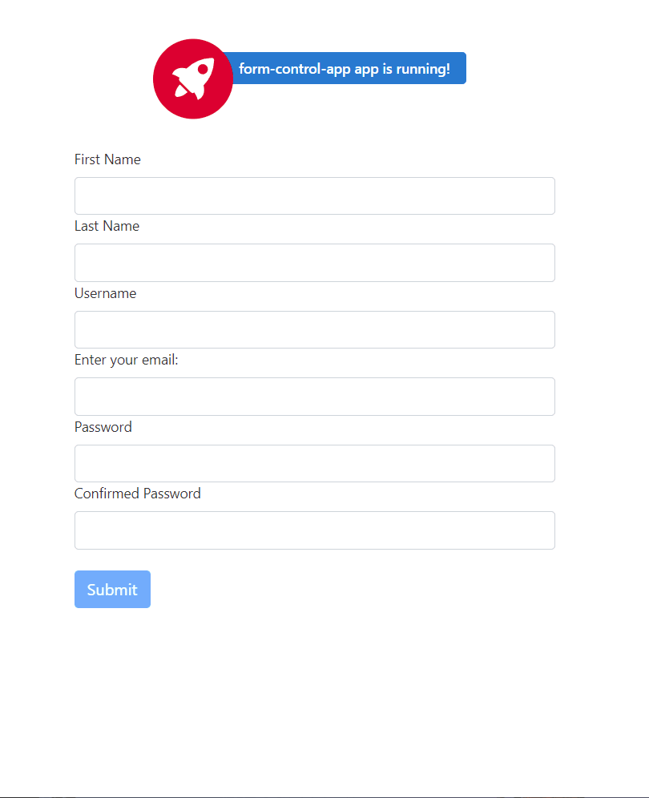

# Demo 

# Introduction
I find the original documentation for Angular Reactive Forms from [angular.io guide](https://angular.io/guide/form-validation) is very confused. Therefore, I love to give the simplest article to demonstrate on how to use the validation in Angular Reactive Forms
In this article, we will learn the following
1. Build a simple user form using Angular reactive form
2. Implement some inbuilt validation
3. Implement some custom validation

We will consider the following custom validations for this demo
* Check for user name availability
* Check the password pattern
* Check the password matching

# Prerequiestes
* Install Visual Studio Code (VS Code) from [here](https://code.visualstudio.com/download)
* Install NodeJS from [here](https://nodejs.org/en/download/)
* Install the Angular CLI from [here](https://cli.angular.io/)
# Source Code
# Create the Angular application
```
ng new form-control-app --routing=false --style=css
```
In this project, we will not use any routing feature, and we will use bootstrap as CSS for styling the DOM (Document Object Module) element.
The command above will create a new Angular project with the name `form-control-app` 
# Install Bootstrap
Change the directories to the new project
```
cd .\form-control-app
npm install bootstrap --save
```
# Open the project in VS Code
Open the project in VS Code
```
code .
```
Open the terminal in the VS Code by pressing the combination key (Ctrl + J)
# Adding Bootstrap to the application
Open the style.css file under the location `src\styles.css`
Adding the following import definition
```
@import "~bootstrap/dist/css/bootstrap.css";
```
# Create the reactive form component
Run the following command in the terminal
```
ng generate component user-form
```
You can also use the short form of the command
```
ng g c user-form
```
# Import the `FormsModule` and `ReactiveFormsModule`
Open the file `src\app\app.module.ts`, and copy the code below
```javascript
import { BrowserModule } from '@angular/platform-browser';
import { NgModule } from '@angular/core';
import { FormsModule, ReactiveFormsModule } from '@angular/forms';

import { AppComponent } from './app.component';
import { UserFormComponent } from './user-form/user-form.component';

@NgModule({
  declarations: [
    AppComponent,
    UserFormComponent
  ],
  imports: [
    BrowserModule,
    FormsModule,
    ReactiveFormsModule
  ],
  providers: [],
  bootstrap: [AppComponent]
})
export class AppModule { }
```

# Adding simple form with built-in validations
Open the `src\app\user-form\user-form.component.ts` and copy the following code below
```javascript
import { Component, OnInit } from '@angular/core';
// Import Form Control Module from angular/forms
import { FormGroup, FormControl, Validators } from '@angular/forms';

@Component({
  selector: 'app-user-form',
  templateUrl: './user-form.component.html',
  styleUrls: ['./user-form.component.css']
})
export class UserFormComponent implements OnInit {

  // Create the property to hold the FormGroup
  userForm: FormGroup;

  submitted: boolean = true;

  constructor() { }

  ngOnInit(): void {
    this.userForm = new FormGroup({
      // First Name field
      firstName: new FormControl('', [
        Validators.required // required validator                
      ]),
      lastName: new FormControl('', [
        Validators.required // required validator                
      ]),
      userName: new FormControl('', [
        Validators.required, // required validator                
        Validators.minLength(4), // Minimum length of the username is 4 characters
        Validators.maxLength(20), // Maximum length of the username is 20 characters
      ]),
      email: new FormControl('', [
        Validators.required
      ]),
      password: new FormControl('', [
        Validators.required // required validator                
      ]),
      confirmedPassword: new FormControl('', [
        Validators.required // required validator                
      ]),
    })
  }

  // Get the form control
  get userFormControl () {
    return this.userForm.controls;
  }

  // Handle submit event
  onSubmit () {
    this.submitted = true;
    // Check the validation
    if (this.userForm.valid) {
      alert("Thank you for register");
      console.log(this.userForm.value); // Log out the form values in the console browser
    } else {
      alert("Thank you for register");
    }
  }
}
```
We create a variable `userForm` of type `FormGroup`. In the `ngOnInit` method, we set the form by initializing it with all the default values and built-in validators.
The `userFormControl` property will return the form controls of this form.
The on submit handler event `onSubmit` will print out the content of the form on the browser console.
Now, open the `src\app\user-form\user-form.component.html` and put the following code in it

```HTML
<div class="container">
  <form [formGroup]="userForm" (ngSubmit)="onSubmit()">
    <label for="firstName">First Name</label>
    <input type="text" id="firstName" class="form-control" name="firstName" formControlName="firstName" />
    <div class="text-danger"
      *ngIf="(userFormControl.firstName.touched || submitted) && userFormControl.firstName.errors?.required">
      First Name is required
    </div>
    <label for="lastName">Last Name</label>
    <input type="text" id="lastName" class="form-control" name="lastName" formControlName="lastName" />
    <div class="text-danger"
      *ngIf="(userFormControl.lastName.touched || submitted) && userFormControl.lastName.errors?.required">
      First Name is required
    </div>
    <label for="userName">Username</label>
    <input type="text" id="userName" class="form-control" name="userName" formControlName="userName" />
    <div class="text-danger"
      *ngIf="(userFormControl.userName.touched || submitted) && userFormControl.userName.errors?.required">
      UserName is required
    </div>
    <label for="email">Enter your email:</label>
    <input type="email" id="email" name="email" class="form-control" formControlName="email">
    <div class="text-danger"
      *ngIf="(userFormControl.email.touched || submitted) && userFormControl.email.errors?.required">
      Email is required
    </div>
    <label for="password">Password</label>
    <input type="password" id="password" class="form-control" name="password" formControlName="password" />
    <div class="text-danger"
      *ngIf="(userFormControl.password.touched || submitted) && userFormControl.password.errors?.required">
      Password is required
    </div>
    <label for="confirmedPassword">Confirmed Password</label>
    <input type="password" id="confirmedPassword" class="form-control" name="confirmedPassword"
      formControlName="confirmedPassword" />
    <div class="text-danger"
      *ngIf="(userFormControl.confirmedPassword.touched || submitted) && userFormControl.confirmedPassword.errors?.required">
      Password is required
    </div>
    <br />
    <button type="submit" class="btn btn-primary" [disabled]="userForm.invalid">Submit</button>
  </form>
</div>
```
# Update the `app.component.html`
We update the `src\app\app.component.html` file to display our form. Please copy the code below and put it in `src\app\app.component.html`
```html
<div class="container mt-5">
  <app-user-form></app-user-form>
</div>
```
In the termminal, we will run the command to start the application
```
ng serve --open
```
This will open the application in the web browser at the post 4200 http://localhost:4200/
# Create custom validation service
Open the new terminal windows and run the following command to create a new service
```
ng generate service user-validation
```
or the short-form of teh command
```
ng g s user-validation
```
The command will generate the new file `src\app\user-validation.service.ts` and `src\app\user-validation.service.spec.ts`.
Open the file `src\app\user-validation.service.ts` and put the following code in
```javascript
import { Injectable } from '@angular/core';
// Import the validation interface from angular
import { ValidatorFn, AbstractControl } from '@angular/forms';
import { FormGroup } from '@angular/forms';

@Injectable({
  providedIn: 'root'
})
export class UserValidationService {

  constructor() { }

  /**
   * Use to validate the password pattern in the form
   * The password should be
   * 1 - Minimum 8 characters
   * 2 - Has at least one lower case letter
   * 3 - Has at least one upper case letter
   * 4 - Has at least one number
   * If the password failes the check, the property invalidPassword is true
   */
  passordPatternValidator(): ValidatorFn {
    return (passowrdControl : AbstractControl) : { [key: string]: any } => {                
      if (!passowrdControl.value) {
        // password empty or not valid        
        return null;
      }
      const regex = new RegExp('^(?=.*?[A-Z])(?=.*?[a-z])(?=.*?[0-9]).{8,}$');
      const valid = regex.test(passowrdControl.value);
      return valid ? null : { invalidPassword: true };
    }
  }

  /**
   * Use to compare the passwords in two fields.
   * The method take two parameters of type string, which represent the name of the fields to be matched
   * The values of two fields will be get from the form control and matching them
   * If the value does not match, the property passwordMismatch will be true
   * @param {string} password 
   * @param {string} confirmedPassword 
   */
  matchingPassword (password: string, confirmedPassword: string) {
    return (userForm: FormGroup) => {
      const passwordControl = userForm.controls[password];
      const confirmedPasswordControl = userForm.controls[confirmedPassword];

      if (!passwordControl || !confirmedPasswordControl) {
        // invalid
        return null;
      }

      if (confirmedPasswordControl.errors && !confirmedPasswordControl.errors.passwordMismatch) {
        // password not match
        return null;
      }

      if (passwordControl.value !== confirmedPasswordControl.value) {
        // password not match
        confirmedPasswordControl.setErrors({ passwordMismatch: true });
      } else {
        confirmedPasswordControl.setErrors(null);
      }
    };
  }

  /**
   * Use to validator the username already taken
   * setTimeout function to invoke checking half second, this will make sure the error will be thrown when user stop typing
   * @param userControl 
   */
  userNameValidator (userControl: AbstractControl) {
    return new Promise(resolve => {
      setTimeout(() => {        
        if (this.validateUserName(userControl.value)) {               
          resolve({
            userNameNotAvailable: true
          })
        } else {          
          resolve(null);
        }
      }, 500);
    })
  }

  /**
   * Validate the username
   * The username should not be any of the following
   * admin, user, superuser
   * @param {string} userName 
   * @requires {boolean} true if the user is sastified the condition, false otherwise
   */
  validateUserName (userName: string) {
    const excludeUser = ['admin', 'user', 'superuser'];        
    return excludeUser.indexOf(userName) > -1;
  }
}
```
Method `passordPatternValidator` is used to validate the password pattern in the form. teh password pattern should be
1 - Minimum 8 characters
2 - Has at least one lower case letter
3 - Has at least one upper case letter
4 - Has at least one number
If the password failes the check, the property `invalidPassword` is true. Mode detail can be seen in [Defining custom validators](https://angular.io/guide/form-validation#defining-custom-validators)

Method `matchingPassword` is used to compare the passwords in two fields. The method take two parameters of type string, which represent the name of the fields to be matched. The values of two fields will be get from the form control and matching them. Detail on this method can be seen in the documentation for [cross-field validation](https://angular.io/guide/form-validation#cross-field-validation)

Method `userNameValidator` is used to validator the username already taken, the check for takenm username is defined in `validateUserName`. The `setTimeout` function to invoke checking every half second, this will make sure the error will be thrown when user stop typing. If the username fails check the property `userNameNotAvailable` set to true.  Mode detail can be seen in [custom validators](https://angular.io/guide/form-validation#custom-validators)
# Update form component to use custom validators
## `src\app\user-form\user-form.component.ts`
Open the `src\app\user-form\user-form.component.ts` file and put in the code
```jaavscript
import { Component, OnInit } from '@angular/core';
// Import Form Control Module from angular/forms
import { FormGroup, FormControl, Validators } from '@angular/forms';
import { UserValidationService } from '../user-validation.service';

@Component({
  selector: 'app-user-form',
  templateUrl: './user-form.component.html',
  styleUrls: ['./user-form.component.css']
})
export class UserFormComponent implements OnInit {

  // Create the property to hold the FormGroup
  userForm: FormGroup;

  submitted: boolean = false;

  constructor(private userValidator:  UserValidationService) { }

  ngOnInit(): void {
    this.userForm = new FormGroup({
      // First Name field
      firstName: new FormControl('', [
        Validators.required // required validator                
      ]),
      lastName: new FormControl('', [
        Validators.required // required validator                
      ]),
      userName: new FormControl('', [
        Validators.required, // required validator                
        Validators.minLength(4), // Minimum length of the username is 4 characters
        Validators.maxLength(20), // Maximum length of the username is 20 characters        
      ], [this.userValidator.userNameValidator.bind(this.userValidator)]),
      email: new FormControl('', [
        Validators.required,
        Validators.email
      ]),
      password: new FormControl('', Validators.compose([
        Validators.required,
        this.userValidator.passordPatternValidator()
      ])),
      confirmedPassword: new FormControl('', [
        Validators.required // required validator                
      ]),
    }, {
      validators: this.userValidator.matchingPassword('password', 'confirmedPassword')
    })    
  }

  // Get the form control
  get userFormControl () {
    return this.userForm.controls;
  }

  // Handle submit event
  onSubmit () {
    this.submitted = true;
    // Check the validation
    if (this.userForm.valid) {
      console.log(this.userForm.value); // Log out the form values in the console browser
      alert("Thank you for register");      
    } else {
      alert("Thank you for register");
    }
  }
}

```
## `src\app\user-form\user-form.component.html`
Open the `src\app\user-form\user-form.component.html` file and put in the code
```html
<div class="container">
  <form [formGroup]="userForm" (ngSubmit)="onSubmit()">
    <label for="firstName">First Name</label>
    <input type="text" id="firstName" class="form-control" name="firstName" formControlName="firstName" />
    <div class="text-danger"
      *ngIf="(userFormControl.firstName.touched || submitted) && userFormControl.firstName.errors?.required">
      First Name is required
    </div>
    <label for="lastName">Last Name</label>
    <input type="text" id="lastName" class="form-control" name="lastName" formControlName="lastName" />
    <div class="text-danger"
      *ngIf="(userFormControl.lastName.touched || submitted) && userFormControl.lastName.errors?.required">
      First Name is required
    </div>
    <label for="userName">Username</label>
    <input type="text" id="userName" class="form-control" name="userName" formControlName="userName" />
    <div class="text-danger"
      *ngIf="(userFormControl.userName.touched || submitted) && userFormControl.userName.errors?.required">
      UserName is required
    </div>
    <div class="text-danger"
      *ngIf="(userFormControl.userName.touched && userFormControl.userName.errors?.userNameNotAvailable)">
      UserName is not available
    </div>
    <label for="email">Enter your email:</label>
    <input type="email" id="email" name="email" class="form-control" formControlName="email">
    <div class="text-danger"
      *ngIf="(userFormControl.email.touched || submitted) && userFormControl.email.errors?.required">
      Email is required
    </div>
    <div class="text-danger" *ngIf="(userFormControl.email.touched && userFormControl.email.errors?.email)">
      Enter a valid email address
    </div>
    <label for=" password">Password</label>
    <input type="password" id="password" class="form-control" name="password" formControlName="password" />
    <div class="text-danger"
      *ngIf="(userFormControl.password.touched || submitted) && userFormControl.password.errors?.required">
      Password is required
    </div>
    <div class="text-danger"
      *ngIf="(userFormControl.password.touched && userFormControl.password.errors?.invalidPassword)">
      Password should have minimum 8 characters, at least 1 uppercase letter, 1 lowercase
      letter and 1 number
    </div>
    <label for="confirmedPassword">Confirmed Password</label>
    <input type="password" id="confirmedPassword" class="form-control" name="confirmedPassword"
      formControlName="confirmedPassword" />
    <div class="text-danger"
      *ngIf="(userFormControl.confirmedPassword.touched || submitted) && userFormControl.confirmedPassword.errors?.required">
      Password is required
    </div>
    <div class="text-danger"
      *ngIf="(userFormControl.confirmedPassword.touched && userFormControl.confirmedPassword.errors?.passwordMismatch)">
      Passwords does not match
    </div>
    <br />
    <button type="submit" class="btn btn-primary" [disabled]="userForm.invalid">Submit</button>
  </form>
</div>
```
# Run Demo
Open the terminal and run teh following command
```
ng serve -o
```
If you already serve, and having the error, please try to terminate the application and re-run it.
# Summary
* The Angular reactive form is successfully created
* Get the source code from [GitHub] and play around.

